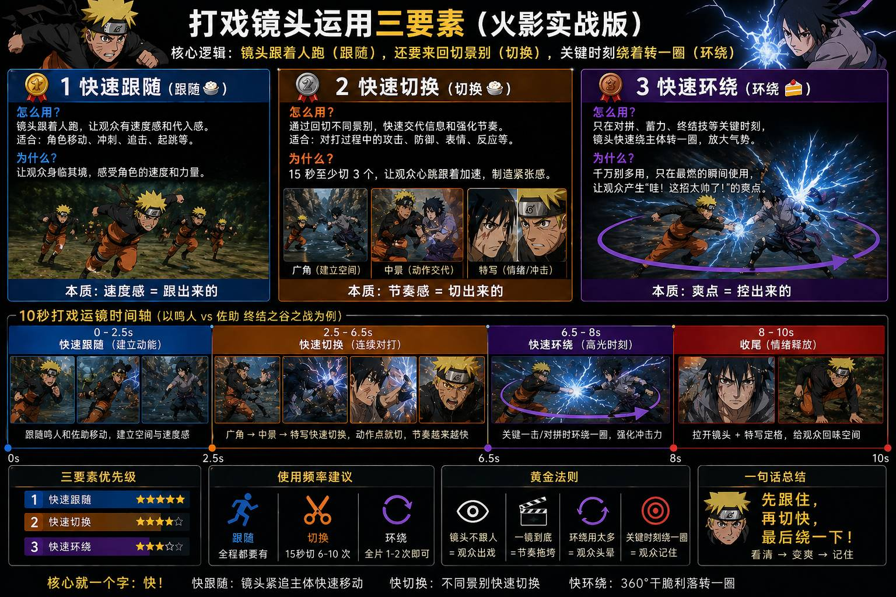
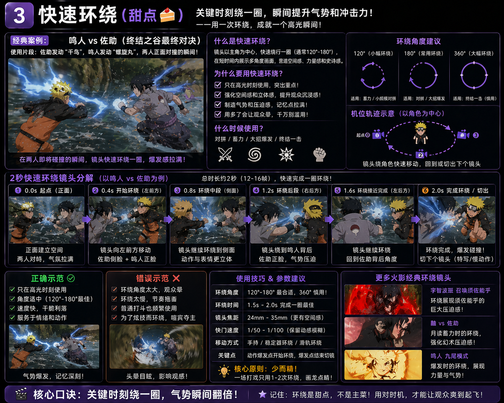
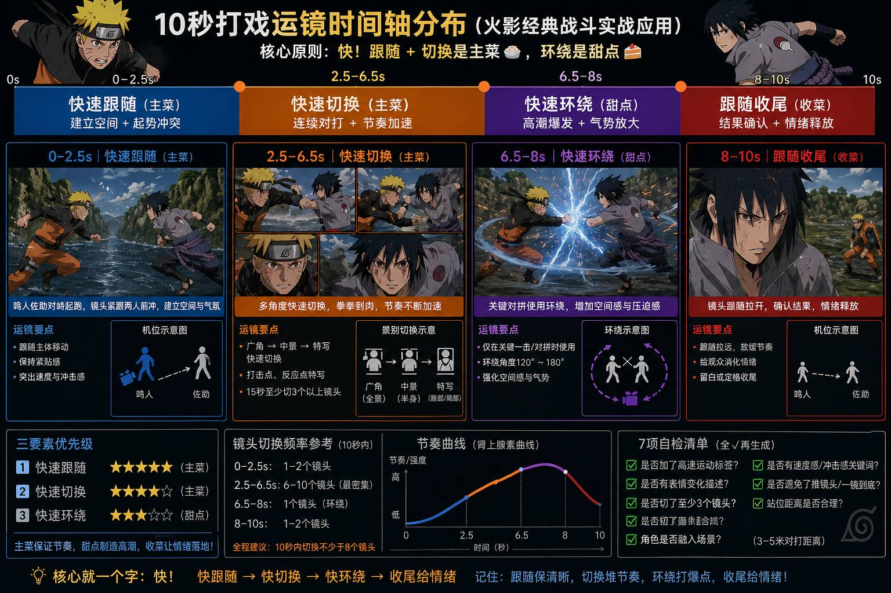
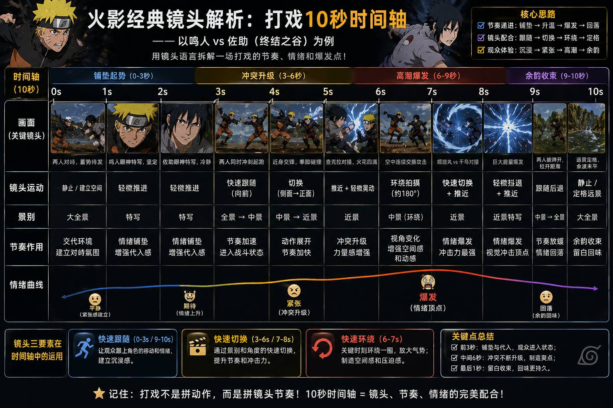
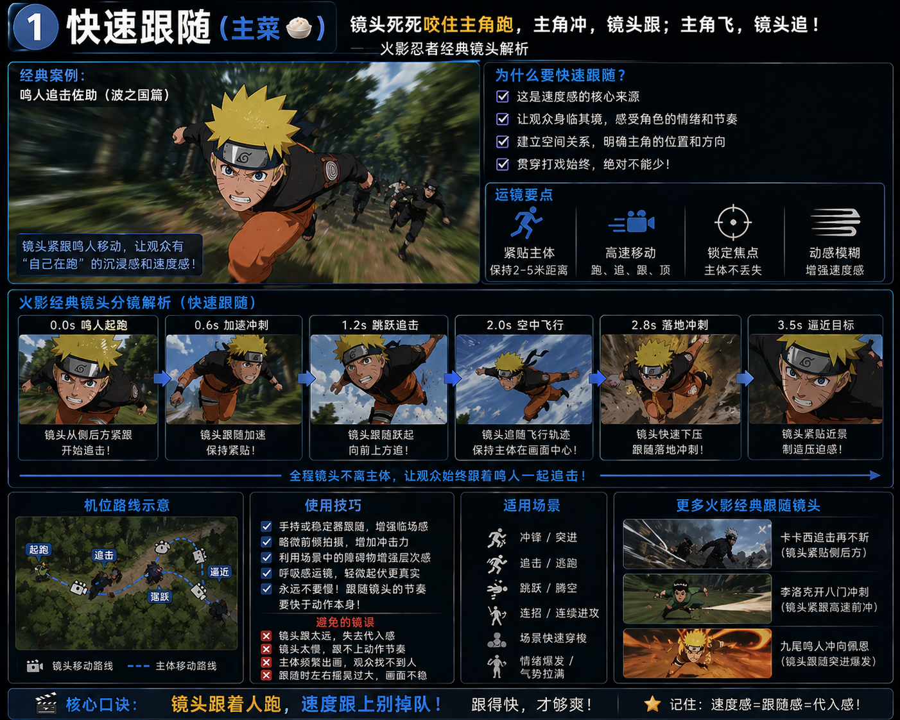

# 🥊 叶老师 (Lark YeLaoshi)

> 基于真人动画导演(叶老师)实战培训的 AI 打戏/动作视频生成指导
> 版本:v1.0.0 | 2026-04-30

---

## 📦 简介

本 Skill 封装了叶老师关于动画打戏制作的全部核心规则,帮助 AI 在生成打戏/动作视频提示词时自动遵循专业导演的标准。

**适用模型**:Seedance 2.0 / 可灵 1.6 Pro / Runway Gen-3 / 即梦

---

## 🚀 触发场景

当用户需求涉及以下内容时,自动加载本 Skill:

- **关键词**:打戏、打斗、战斗、对战、武侠战斗、仙侠战斗、动作视频、武打、对打、连招
- **引用**:提到"叶老师"、"叶老师说"、"打戏运镜"
- **诊断**:用户发来 AI 生成的打戏视频/提示词要求点评

---

## 🎯 核心能力

### 1. 五大致命问题诊断

| 问题 | 说明 | 修复方式 |
|:---:|------|----------|
| 1 | 没有速度感 | 必加标签 `高速运动` + 动态模糊 |
| 2 | 画面没有冲击感 | 必加 `高速运镜跟随` + 低角度/仰拍 |
| 3 | 站得太近 | 明确站位距离(3-5 米交战区) |
| 4 | 瞬移/穿帮 | 必加 `连续动作` + 明确位移轨迹 |
| 5 | 人和场景隔开 ← 最严重 | 必加 `角色融入场景` + 光影交互 |

### 2. 表情强制规则

**战斗中绝不允许"死脸"**

| 状态 | 表情 | 提示词 |
|------|------|--------|
| 攻击 | 咬牙切齿/怒吼 | `fierce expression, gritting teeth` |
| 防御 | 痛苦/吃力 | `strained expression, grimacing` |
| 碾压 | 微笑/从容 | `slight confident smirk` |
| 受击 | 痛苦/惊讶 | `shocked expression, wincing` |

### 3. 运镜三要素

> "看这 3 个词,如果谁没加,我要换人的。"

| 优先级 | 要素 | 场景 | 说明 |
|:---:|------|------|------|
| **1** | **高速运镜跟随** | 追逐/连招 | 镜头追主体,速度感来源(最重要!) |
| **2** | **快速切换** | 连击/混战 | 快速剪辑增强冲击(15 秒至少切 3 个) |
| **3** | **环绕运镜** | 对峙/蓄力 | 干脆利落,不要慢悠悠(高光时刻点缀) |

### 4. 镜头规则

- ❌ 禁用推镜头 / 一镜到底
- ❌ 前 3 个固定镜头不要运镜
- ❌ 对话时不要乱旋转运镜
- ✅ 15 秒必须切至少 3 个镜头
- ✅ 切镜公式:固定建立空间 → 高速跟随/环绕 → 固定收招

### 5. 7 项自检清单

- [ ] 高速运动标签?
- [ ] 表情变化描述?
- [ ] 至少 3 个切镜?
- [ ] 角色融入场景?
- [ ] 速度感/冲击感关键词?
- [ ] 避免推镜头/一镜到底?
- [ ] 站位距离合理?

**7 项全勾 ✅ 才可提交生成**

### 6. AI 模型避坑

| 模型 | 问题 | 解决 |
|------|------|------|
| 即梦 (Jimeng) | 偷懒生成慢镜头/"拉稀感" | 出现直接换模型 |
| Seedance 2.0 | 默认中性表情 | 提示词前 30% 强制写表情 |
| 可灵 1.6 Pro | 人物浮空 | 加 `grounded stance` |

---

## 📂 目录结构

```
lark-yelaoshi/
├── SKILL.md                    # 核心规则 + 触发逻辑
├── README.md                   # 本文件
└── references/
    ├── raw_transcript.md       # 叶老师培训原始对话记录
    ├── core_rules.md           # 详细规则与示例
    └── examples/               # 🆕 实战案例(含参考图+提示词)
        ├── sword_poses.md      # C03 执剑姿态案例(悬崖云海+暗调战场)
        └── swordsman_blue/     # 🆕 男剑客蓝焰灵剑战斗案例(6 图)
```

---

## 🖼️ 叶老师运镜三要素 · 视觉图解

以下图片展示了应用**叶老师规则**后的实际生成效果。通过画面细节，直观解释核心概念。

### 1️⃣ 快速跟随 (Fast Tracking)
> **"镜头追着主体跑，速度感来源"**



*   **画面特征**：角色全速冲锋，镜头紧跟其后。
*   **规则体现**：衣摆与发丝向后剧烈飘动，体现 `fast camera tracking` 带来的速度感。

### 2️⃣ 快速环绕 (Fast Orbiting)
> **"对拼/蓄力瞬间，干脆利落绕一圈"**



*   **画面特征**：角色侧身回眸，剑光划过。
*   **规则体现**：构图暗示镜头正在快速 `orbit`（环绕）角色，捕捉侧面轮廓，营造战斗张力。

### 3️⃣ 快速切换 (Fast Cutting)
> **"15 秒至少切 3 个镜头，不能一镜到底"**

| 中景动作 (Mid-shot) | 面部特写 (Close-up) |
| :---: | :---: |
|  |  |

*   **画面特征**：从全身/中景动作瞬间切换到面部特写。
*   **规则体现**：景别剧烈变化（中景↔特写），制造视觉冲击，拒绝一镜到底。

### 4️⃣ 表情强制规则 (Expression)
> **"战斗中绝不允许死脸"**



*   **画面特征**：面部特写展示清晰的战斗情绪。
*   **规则体现**：眼神凌厉专注，眉头微皱（`fierce expression`），完全没有"木头人"般的放空表情。

---

## 🔗 相关链接

- GitHub: https://github.com/chengbenchao/lark-yelaoshi
- 夏导引擎: https://github.com/chengbenchao/xiameng-prompt-engineer

---

## 📄 许可

MIT License
