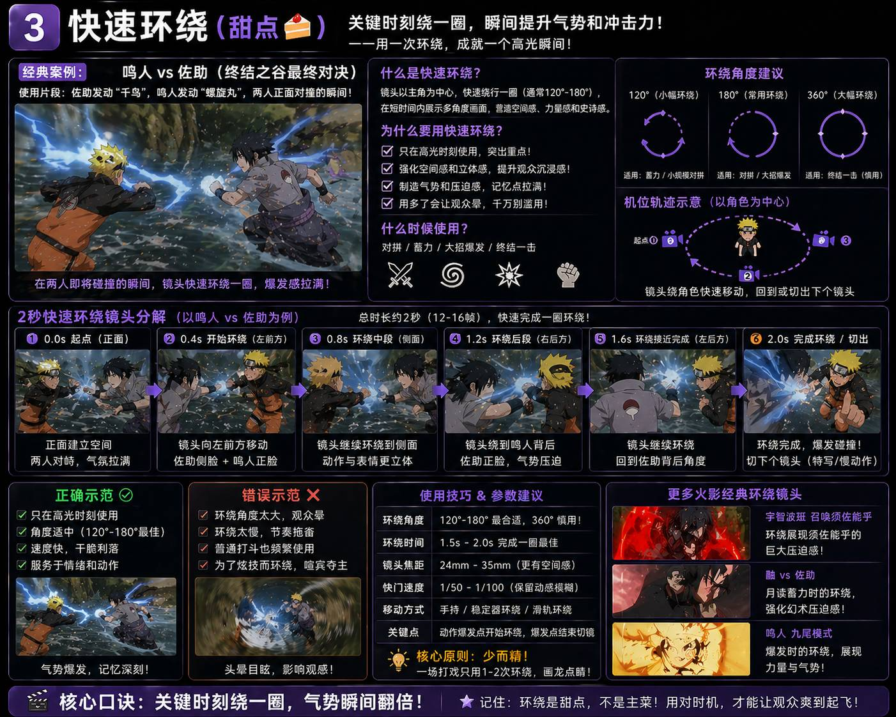

# 🥊 叶老师 (Lark YeLaoshi)

> 基于真人动画导演(叶老师)实战培训的 AI 打戏/动作视频生成指导
> 版本:v1.0.0 | 2026-04-30

---

## 📦 简介

本 Skill 封装了叶老师关于动画打戏制作的全部核心规则,帮助 AI 在生成打戏/动作视频提示词时自动遵循专业导演的标准。

**适用模型**:Seedance 2.0 / 可灵 1.6 Pro / Runway Gen-3 / 即梦

---

## 🚀 触发场景

当用户需求涉及以下内容时,自动加载本 Skill:

- **关键词**:打戏、打斗、战斗、对战、武侠战斗、仙侠战斗、动作视频、武打、对打、连招
- **引用**:提到"叶老师"、"叶老师说"、"打戏运镜"
- **诊断**:用户发来 AI 生成的打戏视频/提示词要求点评

---

## 🎯 核心能力

### 1. 五大致命问题诊断

| 问题 | 说明 | 修复方式 |
|:---:|------|----------|
| 1 | 没有速度感 | 必加标签 `高速运动` + 动态模糊 |
| 2 | 画面没有冲击感 | 必加 `高速运镜跟随` + 低角度/仰拍 |
| 3 | 站得太近 | 明确站位距离(3-5 米交战区) |
| 4 | 瞬移/穿帮 | 必加 `连续动作` + 明确位移轨迹 |
| 5 | 人和场景隔开 ← 最严重 | 必加 `角色融入场景` + 光影交互 |

### 2. 表情强制规则

**战斗中绝不允许"死脸"**

| 状态 | 表情 | 提示词 |
|------|------|--------|
| 攻击 | 咬牙切齿/怒吼 | `fierce expression, gritting teeth` |
| 防御 | 痛苦/吃力 | `strained expression, grimacing` |
| 碾压 | 微笑/从容 | `slight confident smirk` |
| 受击 | 痛苦/惊讶 | `shocked expression, wincing` |

### 3. 运镜三要素

> "看这 3 个词,如果谁没加,我要换人的。"

| 优先级 | 要素 | 场景 | 说明 |
|:---:|------|------|------|
| **1** | **高速运镜跟随** | 追逐/连招 | 镜头追主体,速度感来源(最重要!) |
| **2** | **快速切换** | 连击/混战 | 快速剪辑增强冲击(15 秒至少切 3 个) |
| **3** | **环绕运镜** | 对峙/蓄力 | 干脆利落,不要慢悠悠(高光时刻点缀) |

### 4. 镜头规则

- ❌ 禁用推镜头 / 一镜到底
- ❌ 前 3 个固定镜头不要运镜
- ❌ 对话时不要乱旋转运镜
- ✅ 15 秒必须切至少 3 个镜头
- ✅ 切镜公式:固定建立空间 → 高速跟随/环绕 → 固定收招

### 5. 7 项自检清单

- [ ] 高速运动标签?
- [ ] 表情变化描述?
- [ ] 至少 3 个切镜?
- [ ] 角色融入场景?
- [ ] 速度感/冲击感关键词?
- [ ] 避免推镜头/一镜到底?
- [ ] 站位距离合理?

**7 项全勾 ✅ 才可提交生成**

### 6. AI 模型避坑

| 模型 | 问题 | 解决 |
|------|------|------|
| 即梦 (Jimeng) | 偷懒生成慢镜头/"拉稀感" | 出现直接换模型 |
| Seedance 2.0 | 默认中性表情 | 提示词前 30% 强制写表情 |
| 可灵 1.6 Pro | 人物浮空 | 加 `grounded stance` |

---

## 📂 目录结构

```
lark-yelaoshi/
├── SKILL.md                    # 核心规则 + 触发逻辑
├── README.md                   # 本文件
└── references/
    ├── raw_transcript.md       # 叶老师培训原始对话记录
    ├── core_rules.md           # 详细规则与示例
    └── examples/               # 🆕 实战案例(含参考图+提示词)
        ├── sword_poses.md      # C03 执剑姿态案例(悬崖云海+暗调战场)
        └── swordsman_blue/     # 🆕 男剑客蓝焰灵剑战斗案例(6 图)
```

---

## 🖼️ 叶老师运镜三要素 · 视觉图解

### 总览：打戏运镜三要素


**核心口诀**：跟得上，切得快，绕得妙，打戏才爽！

| 要素 | 定位 | 使用场景 | 核心作用 |
|:---:|:---:|------|------|
| 快速跟随 | 主菜 | 追逐/连招/高速对打 | 速度感、代入感、沉浸感 |
| 快速切换 | 主菜 | 连击/混战/情绪爆发 | 节奏感、紧张感、冲击力 |
| 快速环绕 | 甜点 | 对拼/蓄力/大招爆发 | 气势感、空间感、爆发感 |

**黄金配比**：70%跟随 + 20%切换 + 10%环绕 = 一场热血打戏！

---

### 1️⃣ 快速跟随（主菜🍚）— 火影忍者经典镜头解析


**核心口诀**：
>  **镜头跟着人跑，速度跟上别掉队！跟得快，才够爽！**

**运镜要点**：
- ✅ 紧贴主体，保持 2-5 米距离
- ✅ 高速移动：跑、追、跟、顶
- ✅ 锁定焦点，主体不丢失
- ✅ 动感模糊，增强速度感

**经典案例**：鸣人追击佐助（波之国篇）、卡卡西追击再不斩、李洛克开八门冲刺

---

### 2️⃣ 快速切换（主菜🍚）— 鸣人 VS 佐助经典分镜解析


**核心口诀**：
>  **别拍到底！广角→中景→特写→再切回→节奏就上头！**
>  **切得快，不迷路；切得准，才够爽！**

**核心目的**：制造紧张感和节奏感

**切镜规则**：
- ✅ 15秒至少切3个镜头，4秒切6-8次
- ✅ 单个镜头时长0.3-0.8秒，越短越刺激
- ✅ 动作点切换：每次出拳、闪避、受击都是切换时机
- ✅ 不同景别切换：广角建立空间→中景展示动作→特写强化冲击

**不同景别的作用**：
- 🎬 广角(24mm)：建立空间和环境
-  中景(35-50mm)：展现动作过程
- ️ 特写(85mm+)：突出表情/细节/冲击力
- ✊ 局部特写：强化打击感

**经典案例**：鸣人 VS 佐助（终结之谷）、火影忍者疾风传第107集

---

### 3️⃣ 快速环绕（甜点）— 鸣人 VS 佐助螺旋丸 VS 千鸟



**核心口诀**：
>  **关键时刻绕一圈，气势瞬间翻倍！**
>  **环绕是甜点，不是主菜！用对时机，才能让观众爽到起飞！**

**核心目的**：瞬间提升气势和冲击力

**使用场景**：
- ✅ 对拼/蓄力/大招爆发/终结一击
- ✅ 只在高光时刻使用，突出重
- ✅ 一场打戏只用1-2次环绕，画龙点睛

**环绕参数建议**：
- 环绕角度：120°~180°最合适，360°慎用（容易头晕）
- 环绕时间：1.5s - 2.0s 完成一圈最佳
- 镜头焦距：24mm - 35mm（更有空间感）
- 移动方式：手持/稳定器环绕/滑轨环绕

**错误示范**：
- ❌ 环绕角度太大，观众头晕
- ❌ 环绕太慢，节奏拖沓
- ❌ 普通打斗也频繁使用
- ❌ 为了炫技而环绕，喧宾夺主

**经典案例**：
- 鸣人螺旋丸 VS 佐助千鸟（终结之谷）
- 宇智波斑召唤须佐能乎（环绕展现压迫感）
- 鸣人九尾模式爆发时的环绕

---
以下图解直观展示了**10 秒打戏**中如何运用叶老师的运镜三要素（跟随、切换、环绕）。


### 📊 核心逻辑解析 (对应图片内容)

**核心原则**：核心原则：快！跟随 + 切换是主菜 🍚，环绕是甜点 🍰

| 时间段 | 运镜要素 | 定位 | 画面描述 (图标) | 核心说明 |
|:---:|------|:---:|:---:|------|
| **0-3 秒** | **快速跟随** | 🍚 主菜 | 📹 镜头紧追冲锋的主角 | 镜头追着主体跑，速度感来源 |
| **3-4 秒** | **快速环绕** | 🍰 甜点 | 🎥 武器相撞高光时刻 | 对拼/蓄力瞬间快速绕半圈 |
| **4-8 秒** | **快速切换** | 🍚 主菜 | ✂️ 全景/中景/特写来回切 | 不能一镜到底，观众心跳加速 |
| **8-10 秒** | **特写收尾** | 🎬 结束 | 📸 镜头推进面部特写 | 英雄亮相 |

**图例**：
🟦 蓝=快速跟随 (主菜) | 🟪 紫=快速环绕 (甜点) | 🟧 橙=快速切换 (主菜) | 🟥 红=特写收尾

---

## 🔗 相关链接

- GitHub: https://github.com/chengbenchao/lark-yelaoshi
- 夏导引擎: https://github.com/chengbenchao/xiameng-prompt-engineer

---

## 📄 许可

MIT License
